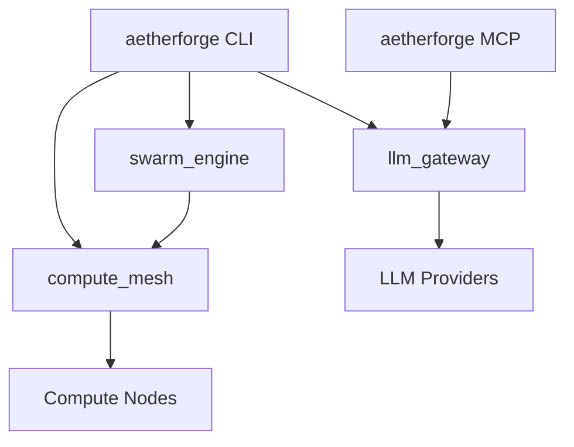

# aetherforge — Architecture

> **Layer**: X 横切框架
> **Role**: 算力网格 + LLM 网关 + 群体智能引擎
> **Stack**: Python 3.13+, uv workspace, hatchling, fastmcp
> **Health**: See local CI and package-level verification
> **SSOT**: 运行时健康、包级成熟度、能力并入状态以本项目 CI、本地验证和 workspace governance SSOT 为准
> **Note**: LLM Gateway 能力已于 2026-06-16 从 `projects/llm-gateway/` 并入 `packages/gateway/`
>
> 系统全景参见：[`docs/ARCHITECTURE-DIAGRAM.md`](../docs/ARCHITECTURE-DIAGRAM.md)

---

## 1. 内部架构



## 2. 入口

| Type | Entry | Port / Notes |
|:--|:--|:--|
| CLI | `aetherforge` | gateway/mesh/swarm subcommands |
| MCP stdio | `aetherforge-mcp` | forge_generate, forge_mesh_status, ... |

## 3. 核心模块

| Module | Responsibility |
|:--|:--|
| `src/aetherforge/cli.py` | Unified CLI dispatcher |
| `src/aetherforge/mcp_server.py` | Aggregated MCP server |
| `packages/gateway/src/llm_gateway/` | LLM provider routing / fallback (target SSOT) |
| `packages/gateway/src/llm_gateway/_legacy/` | Migrated code from `projects/llm-gateway/` |
| `packages/gateway/MERGE-CHECKLIST.md` | Capability merge roadmap |
| `packages/mesh/src/compute_mesh/` | Compute node discovery / scheduler |
| `packages/swarm/src/swarm_engine/` | Swarm orchestration |

## 4. 测试

```bash
cd projects/aetherforge && make test
```
