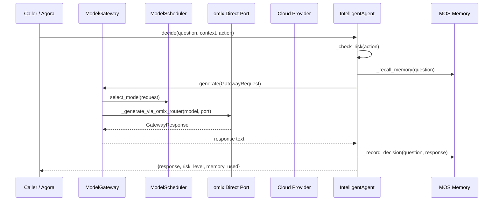

# aetherforge — Call Chain

> 本文档描述 aetherforge 内部最核心的一条调用链 / 数据流。
>
> 通用跨层调用链参见：[`../../docs/I0-AGORA-CALLCHAIN.md`](../../docs/I0-AGORA-CALLCHAIN.md)

---

## 关键路径 (2026-08-09 重构后)

### LLM 推理调用链

```
Caller (CLI/IntelligentAgent/triage)
  → ModelGateway.generate(GatewayRequest)
    → _ensure_registry_ready() — registry.refresh() discovers 185+ models
    → K1 sensitive check — block sensitive content from cloud
    → ModelScheduler.select_model() — Filter→Score pipeline picks best model
    → fallback chain iteration:
      → _try_generate(model_name):
        ├─ local omlx (in model_ports): _generate_via_omlx_router()
        │   → _ensure_model() → omlx load on port
        │   → GET /v1/models → cache real model_id
        │   → POST :{port}/v1/chat/completions with real model_id
        │   → strip_thinking() → GatewayResponse
        └─ cloud models: _resolve_model_id() → registry.chat() → provider
    → MetricsCollector.record_generation()
```

### Swarm 工作流调用链

```
aetherforge swarm run --goal X
  → WorkflowRegistry.create("default") → GraphWorkflow
    → node "任务规划": IntelligentAgent.decide()
      → _check_risk() → RiskEngine.evaluate()
      → _recall_memory() → MOSBeliefManager.query_beliefs()
      → _llm_ask() → ModelGateway.generate()
      → _record_decision() → MOS.record_decision_outcome()
    → node "任务执行": IntelligentAgent.decide()
    → GraphWorkflow.run() with checkpoint/admission/retry
```

### cc-switch 凭据同步链

```
cc-switch GUI (iCloud DB)
  → import_from_cc_switch()
    → _find_cc_switch_db() — finds largest DB (iCloud > local)
    → read providers table → extract API keys from settings_config.env
    → CredentialsManager.add_key() for each provider
    → PricingRegistry.register() for model_pricing table
    → SSOTProviderAdapter picks up credentials for compute_engine providers
```

## Sequence Diagram


