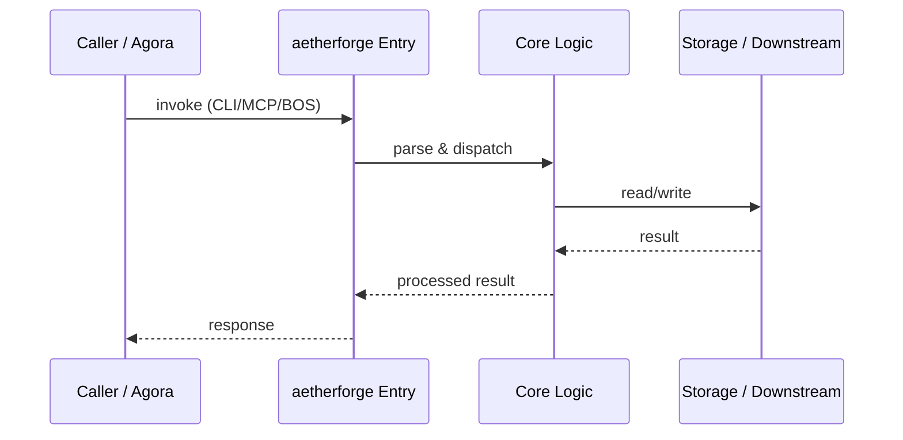

# aetherforge — Call Chain

> 本文档描述 aetherforge 内部最核心的一条调用链 / 数据流。
>
> 通用跨层调用链参见：[`../../docs/I0-AGORA-CALLCHAIN.md`](../../docs/I0-AGORA-CALLCHAIN.md)

---

## 关键路径

1. 1. `aetherforge` CLI receives `gateway` / `mesh` / `swarm` subcommand
2. 2. `config.py` loads `aetherforge.yaml` + env defaults
3. 3. Gateway routes LLM request through provider registry, scheduler, policies
4. 4. Mesh discovers compute nodes and dispatches tasks
5. 5. Swarm engine orchestrates multi-agent workflows
6. 6. MCP server exposes aggregated tools to agora

## Sequence Diagram

