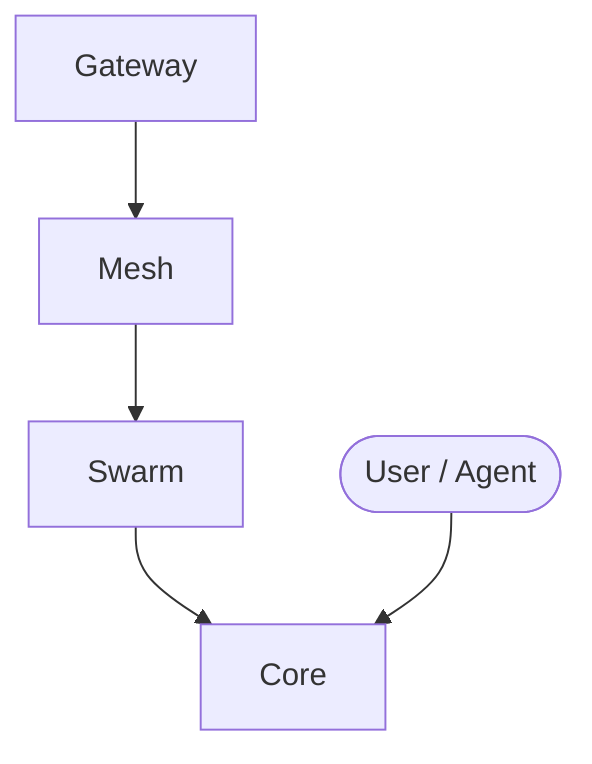

# AetherForge Architecture

> Architecture overview for **AetherForge**. For the full workspace architecture, see [`../../ARCHITECTURE.md`](../../ARCHITECTURE.md).

## Responsibilities

AetherForge is part of the eCOS v6 workspace. See [`../README.md`](../README.md) for a one-line description and [`../CAPABILITY-MAP.md`](../CAPABILITY-MAP.md) for capability mapping.

## Key Surfaces

- `packages/gateway/` — LLM Gateway (ModelGateway, ModelScheduler, CredentialsManager, cc-switch sync, SSOT loader)
- `packages/mesh/` — Compute Mesh (topology discovery, node scheduler, worker pool)
- `packages/swarm/` — Swarm Engine (GraphWorkflow, Hatcher, IntelligentAgent, risk/trust/pi, digital brain workers)
- `src/aetherforge/` — Core (CLI, MCP server, triage router, route scheduler)

## Architecture

### Model Routing (3-tier)

| Tier | Source | Models | Routing |
|------|--------|--------|---------|
| Local | omlxcd Unix-socket API | Runtime inventory | AetherForge alias → omlxc physical placement |
| Cloud Paid | DeepSeek, OpenRouter, Anthropic | 74 | Registry → SSOTProviderAdapter → direct API |
| Cloud Free/Forward | GLM, Kimi, MiniMax, Nvidia, etc. | 47 | cc-switch → CredentialsManager → SSOTProviderAdapter |

### Key Components

- **ModelGateway** — Unified LLM entry point with K1 detection, logical aliases, migration modes, and AetherForge-owned cloud policy
- **OmlxcClient** — Typed bounded UDS client for route planning, chat/SSE, and embeddings; it never reads omlxc files or invokes its CLI
- **IntelligentAgent** — 5-layer decision chain: Risk Gate → MOS Memory → LLM → Decision Record → Trust Feedback
- **GraphWorkflow** — DAG-based workflow engine with checkpoint/resume, admission grants, retry policy
- **Hatcher** — Agent factory spawning CLI subprocesses, internal threads, or external agent CLIs
- **RiskEngine** — 5-level dynamic safety gate (L0 auto → L4 forbidden) with trust accumulation
- **cc-switch Adapter** — Syncs 15 cloud providers + 57 model prices from cc-switch iCloud DB

## Design Notes

- Runtime facts (counts, ports, health) are intentionally not maintained here. Use the workspace registries and project source as the truth.
- The authenticated `9290` OpenAI facade remains the public local entry. The optional `4000` transition listener uses the same aiohttp application and `ModelGateway` singleton, so it cannot create a second inference path. Inventory cliffs from omlxcd (`inventory_drop`) are observed on `GET /v1/compute`; `GET /health` stays an identity-only liveness probe.
- `legacy` is rollback-only. `shadow` adds only a read-only plan. `active` routes local work exclusively through omlxc; hybrid may enter the existing cloud chain only after typed unavailable/capacity/timeout failures, while K1 fails closed.
- For boundaries and call chains, read [`../BOUNDARY.md`](../BOUNDARY.md) and [`../CALLCHAIN.md`](../CALLCHAIN.md).
- For developer rules, read [`../AGENTS.md`](../AGENTS.md).

## Component Overview

- Arrows show typical interaction flow, not strict call direction.
- See [`../CALLCHAIN.md`](../CALLCHAIN.md) for detailed call chains.
